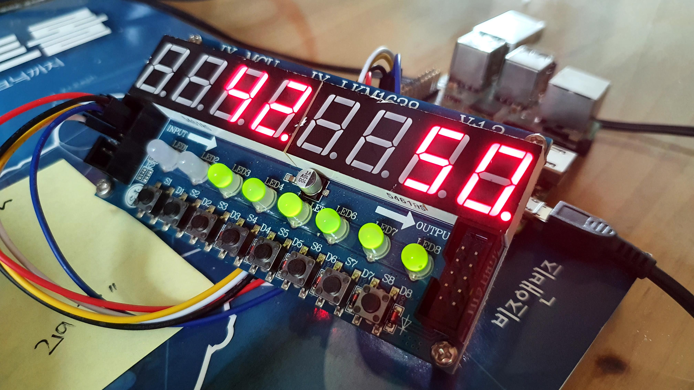

# fnd-twitch-counter

Twitch follower counter of mine(suapapa) in FND display module(tm1638) in RaspberryPi

## build and rund

Host:

    GOOS=linux GOARCH=arm go build

Target:

    ./fnd-twitch-counter -t 50 -l 30 # update every 30 secs and target followers are 50